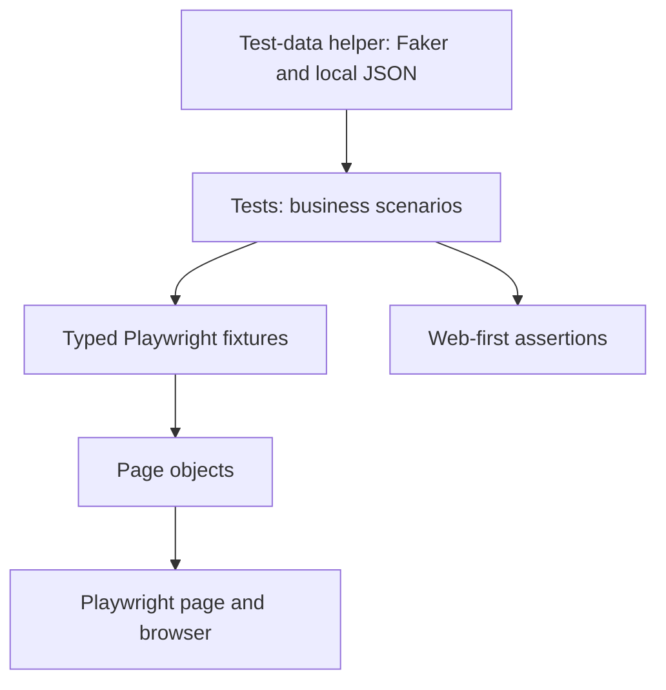

# OrangeHRM UI Automation Framework

A TypeScript UI automation project for the OrangeHRM open-source demo. It demonstrates maintainable Playwright test design through Page Object Model, reusable fixtures, generated test data, and focused smoke and regression suites.

**Application:** [OrangeHRM Demo](https://opensource-demo.orangehrmlive.com/web/index.php/auth/login)

## Project Highlights

- **Page Object Model:** Page-specific locators and actions are encapsulated in focused page classes.
- **Separation of concerns:** Tests describe business flows; page objects handle browser interactions; test-data helpers generate and persist data.
- **Reusable fixtures:** Playwright's `base.extend()` provides typed page objects to tests.
- **DRY test design:** Page objects are created through shared typed fixtures, and generated user data is centralized in one utility.
- **Stable interactions:** Tests use accessible roles and labels, Playwright auto-waiting, and web-first assertions instead of fixed delays.
- **Scenario coverage:** Includes successful and unsuccessful login, required-field validation, and employee/system-user creation.
- **Selective execution:** Smoke and regression tests can be run separately with npm scripts.

## Technology

- TypeScript
- Playwright Test
- Faker for generated employee and account data
- Node.js file APIs for local test-data persistence

## Quick Start

### Requirements

- Node.js 20 or newer
- npm

### Install

```bash
npm install
npx playwright install chromium
```

### Run Tests

Run the complete suite:

```bash
npm test
```

Run the smoke suite for the critical login and page-title checks:

```bash
npm run test:smoke
```

Run all regression scenarios, including negative cases:

```bash
npm run test:regression
```

Run in headed mode or run a particular spec:

```bash
npx playwright test --headed
npx playwright test tests/login.spec.ts
```

Type-check the project without emitting JavaScript:

```bash
npx tsc --noEmit
```

## Architecture



### Responsibilities

- `tests/` contains readable scenarios and assertions; it avoids duplicating page selectors and interaction details.
- `pages/` contains a page object per application area. Each class owns that page's locators and user actions.
- `fixtures/testFixtures.ts` extends Playwright's built-in fixtures and constructs page objects with the provided `page`.
- `utils/userTestData.ts` creates unique data and reads or writes the generated account record.
- `playwright.config.ts` contains the shared test directory, base URL, and browser settings.

### Base Page Decision

There is intentionally no `BasePage` yet. The page objects share a dependency on Playwright's `Page`, but they do not currently share meaningful page-level behavior: navigation, locators, and waits are specific to each workflow. A base class that only stores or forwards `Page` would add inheritance without reducing duplication. If genuinely common behavior appears as the framework grows, it can be extracted then; page-specific locators and actions should remain in their owning page objects.

### Test Flow

```text
Playwright creates page
        -> fixture constructs page objects
        -> test performs a user workflow
        -> page objects interact with OrangeHRM
        -> web-first assertions verify the outcome
```

The account-creation scenario creates an employee in PIM first, then creates an enabled ESS system account for that employee in Admin. This reflects OrangeHRM's requirement that a system account be linked to an employee record.

## Project Structure

```text
pages/
  LoginPage.ts           # Login page locators and actions
  DashboardPage.ts       # Dashboard heading and visibility checks
  PimPage.ts             # Employee creation actions
  AdminUsersPage.ts      # System-user creation and search actions

fixtures/
  testFixtures.ts        # Reusable page-object fixtures

utils/
  userTestData.ts        # Faker generation and saved-user JSON helpers

tests/
  login.spec.ts          # Login and page-title scenarios
  admin-user.spec.ts     # Employee/system-user and validation scenarios

playwright.config.ts     # Shared Playwright Test configuration
package.json             # Dependencies and test commands
tsconfig.json            # TypeScript compiler options
```

## Coverage and Tags

- `@smoke`: valid login and login-page title checks.
- `@regression`: all current functional scenarios.
- `@negative`: invalid login and missing required user details.

Tags are in test titles, so Playwright's `--grep` selects them through the npm scripts. The smoke suite is a quick health check; regression runs the broader current coverage.

## Generated Account Data

The account-creation test uses Faker to generate a unique employee ID, employee name, username, and password. After the account is verified, it saves the latest generated record to `test-data/createdUser.json` for later login or forgot-password scenarios.

Example reuse in a future test:

```typescript
import { loadCreatedUserTestData } from '../utils/userTestData';

const user = await loadCreatedUserTestData();
await loginPage.gotoLoginPage();
await loginPage.login(user.username, user.password);
```

The JSON file contains a password and is excluded by `.gitignore`. It is local test data for the public demo only; do not commit it or use this storage approach for real credentials. The public demo is shared and created employee/user records may persist between test runs.

## Engineering Practices

- Keep each page's locators and actions in its page object.
- Keep scenario intent and assertions in test files.
- Reuse page objects through typed fixtures and share data generation through a helper.
- Prefer semantic locators and assertion-based waiting; do not use `page.waitForTimeout()`.
- Keep changes scoped to the requirement and validate them with TypeScript and the relevant Playwright tests.