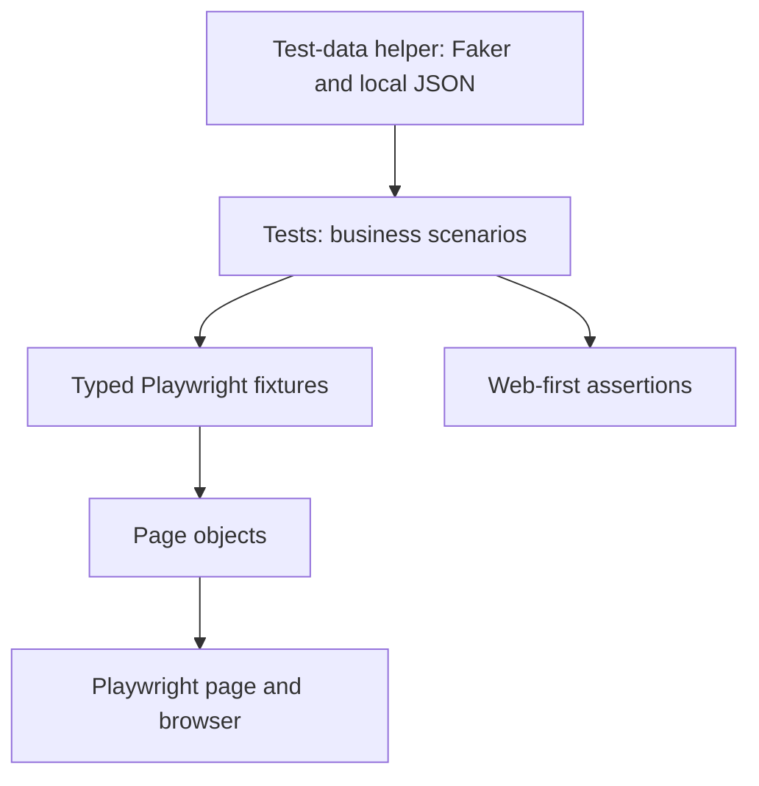

# OrangeHRM UI Automation Framework

A TypeScript UI automation project for the OrangeHRM open-source demo. It demonstrates maintainable Playwright test design through Page Object Model, reusable fixtures, generated test data, and focused smoke and regression suites.

**Application:** [OrangeHRM Demo](https://opensource-demo.orangehrmlive.com/web/index.php/auth/login)

## Project Highlights

- **Page Object Model:** Page-specific locators and actions are encapsulated in focused page classes.
- **Separation of concerns:** Tests describe business flows; page objects handle browser interactions; test-data helpers generate and persist data.
- **Reusable fixtures:** Playwright's `base.extend()` provides typed page objects to tests.
- **DRY test design:** Page objects are created through shared typed fixtures, and generated user data is centralized in one utility.
- **Stable interactions:** Tests use accessible roles and labels, Playwright auto-waiting, and web-first assertions instead of fixed delays.
- **Scenario coverage:** Includes login/recovery flows, dashboard navigation checks, and PIM employee creation, search, update, and validation.
- **Password recovery coverage:** Includes recovery entry, known/unknown usernames, required-field validation, and cancel navigation; email delivery is not claimed by the public-demo tests.
- **Selective execution:** Smoke and regression tests can be run separately with npm scripts.
- **Controlled execution:** Playwright defaults to one worker because tests mutate records in the shared public demo; set `WORKERS` to increase concurrency when using an isolated environment.
- **Centralized diagnostics:** Failure screenshots, videos, traces, Allure results, HTML reports, and test logs are generated through configuration and fixtures.
- **Environment and data support:** dotenv-backed dev/qa/staging settings and typed JSON login scenarios are kept outside individual test flows.

## Technology

- TypeScript
- Playwright Test
- Node.js
- Faker for generated employee and account data
- Node.js file APIs for local test-data persistence
- dotenv and cross-env for environment selection
- Allure Playwright and Allure 3 for test reporting
- Centralized TypeScript logging

## Quick Start

### Requirements

- Node.js 20.19+, 22.13+, or 24+
- npm

### Install

```bash
npm install
npx playwright install chromium
```

The `dev`, `qa`, and `staging` sample files currently target the OrangeHRM demo. Change their `BASE_URL` values for controlled environments. For local overrides, copy `.env.example` to `.env`; do not commit real credentials.

The three sample environment files currently target the OrangeHRM demo. Replace their `BASE_URL` with the URLs for your controlled environments when needed. For local overrides, copy `.env.example` to `.env`; do not commit real credentials.

### Run Tests

Run the complete suite:

```bash
npm test
```

Run the smoke suite for the critical login and page-title checks:

```bash
npm run test:smoke
```

Run all regression scenarios, including negative cases:

```bash
npm run test:regression
```

Run in headed mode or run a particular spec:

```bash
npm run test:headed
npm run test:debug
npm run test:login
npx playwright test tests/login.spec.ts
```

Select an environment with the cross-platform npm scripts:

```bash
npm run test:dev
npm run test:qa
npm run test:staging
```

Select an environment (the scripts use `cross-env` so they work on Windows and Unix shells):

```bash
npm run test:dev
npm run test:qa
npm run test:staging
```

## Failure Artifacts and Allure Reports

### Screenshots

Playwright captures screenshots automatically only when a test fails. Screenshots are saved with that test's output under `test-results/`; tests do not need to call `page.screenshot()`. `BasePage.takeScreenshot(name)` is available for a specific diagnostic screenshot when a test has a clear reason to capture one.

### Traces

Playwright records a trace and retains it for failed tests locally. On CI, tracing is recorded on the first retry. Traces include actions, DOM snapshots, and network activity. Find `trace.zip` in the failing test's `test-results/` folder and inspect it with:

```bash
npx playwright show-trace path/to/trace.zip
```

### Video

Videos are recorded during the test and retained only for failed tests. They are stored with the test's output under `test-results/` to avoid keeping successful-run video files.

### Allure

The configured Allure reporter writes results to `reports/allure-results/` during `npm test`. Result files accumulate between runs; remove that directory before a run when you want a report containing only that run. Generate a browsable report with:

```bash
npm run allure:generate
```

Open and serve the generated report locally with:

```bash
npm run allure:open
```

Allure results and generated reports are ignored by Git. Allure 3 is included as a project dependency and runs on Node.js; Java is not required for these commands. `npm run test:allure` is also available to run Playwright through Allure's CLI integration.

Open the built-in Playwright HTML report with:

```bash
npm run test:report
```

Type-check the project without emitting JavaScript:

```bash
npx tsc --noEmit
```

## Architecture



### Responsibilities

- `tests/` contains readable scenarios and assertions; it avoids duplicating page selectors and interaction details.
- `pages/` contains a page object per application area. Each class owns that page's locators and user actions; `BasePage` contains generic browser helpers only.
- `pages/BasePage.ts` implements generic Playwright operations without application-specific selectors.
- `pages/AdminPage.ts` owns shared Admin navigation and headings; `AdminUsersPage` extends it for system-user workflows.
- `fixtures/testFixtures.ts` extends Playwright's built-in fixtures and constructs page objects with the provided `page`.
- `fixtures/testFixtures.ts` also loads typed login data and logs test lifecycle events automatically.
- `utils/userTestData.ts` creates unique data and reads or writes the generated account record.
- `utils/testDataReader.ts` validates and returns JSON login scenarios.
- `utils/configReader.ts` selects an environment file and resolves typed browser/timeout settings.
- `utils/logger.ts` writes centralized action and test lifecycle logs without recording credentials.
- `playwright.config.ts` contains the shared test directory, base URL, and browser settings.

### Page Object Responsibilities

`BasePage` holds the shared Playwright `Page` and reusable generic actions such as click, fill, navigation, visibility, text retrieval, keyboard input, option selection, page-load waits, URL waits, and explicit screenshots. It contains no OrangeHRM selectors. Each concrete POM owns its own locators and application workflow. `AdminPage` groups shared Admin navigation/heading behavior, and `AdminUsersPage` extends it with user-management operations.

### Test Flow

```text
Playwright creates page
        -> fixture constructs page objects
        -> test performs a user workflow
        -> page objects interact with OrangeHRM
        -> web-first assertions verify the outcome
```

The account-creation scenario creates an employee in PIM first, then creates an enabled ESS system account for that employee in Admin. This reflects OrangeHRM's requirement that a system account be linked to an employee record.

## Project Structure

```text
pages/
  BasePage.ts            # Generic Playwright browser helpers
  LoginPage.ts           # Login page locators and actions
  DashboardPage.ts       # Dashboard heading and visibility checks
  AdminPage.ts           # Shared Admin navigation and heading checks
  ForgotPasswordPage.ts  # Password recovery page actions and confirmation
  PimPage.ts             # Employee creation actions
  AdminUsersPage.ts      # System-user creation and search actions

fixtures/
  testFixtures.ts        # Reusable page-object fixtures

utils/
  logger.ts              # Central TypeScript logger
  configReader.ts        # dotenv and environment configuration
  testDataReader.ts      # Typed JSON login test-data reader
  userTestData.ts        # Faker generation and saved-user JSON helpers

test-data/
  loginData.json         # Valid, invalid, and empty credential cases
  createdUser.json       # Generated locally and ignored by Git

config/
  dev.env
  qa.env
  staging.env

logs/
  test-execution.log     # Created/updated during test runs

reports/
  allure-results/        # Generated Allure test results

tests/
  login.spec.ts          # Login and page-title scenarios
  forgot-password.spec.ts # Password recovery scenarios
  dashboard.spec.ts      # Dashboard navigation checks
  pim.spec.ts            # PIM search, profile, update, and validation cases
  admin-user.spec.ts     # Employee/system-user and validation scenarios

playwright.config.ts     # Shared Playwright Test configuration
package.json             # Dependencies and test commands
tsconfig.json            # TypeScript compiler options
.env.example             # Safe local configuration template
```

## Coverage and Tags

- `@smoke`: valid login, logout, login-page title, Forgot Password entry, and PIM employee search checks.
- `@regression`: all current functional scenarios.
- `@negative`: invalid credentials, missing login/recovery fields, unknown recovery username, nonexistent employee search, duplicate employee ID, and missing required user details.

Tags are in test titles, so Playwright's `--grep` selects them through the npm scripts. The smoke suite is a quick health check; regression runs the broader current coverage.

Forgot Password cases assert the application's UI confirmation only. They do not verify mailbox delivery, which the public demo does not make available for automated testing.

Current Dashboard/PIM coverage includes DASH-002 and PIM-003 through PIM-007, PIM-009, and PIM-011. PIM-008 remains deferred by the test plan because it depends on configured job master data. PIM-010 is not automated: the public demo exposes its destructive delete action as an icon without a stable accessible name, so a reliable and safely scoped locator is not currently available.

## Generated Account Data

The account-creation test uses Faker to generate a unique employee ID, employee name, username, and password. After the account is verified, it saves the latest generated record to `test-data/createdUser.json` for later login or forgot-password scenarios.

Example reuse in a future test:

```typescript
import { loadCreatedUserTestData } from '../utils/userTestData';

const user = await loadCreatedUserTestData();
await loginPage.gotoLoginPage();
await loginPage.login(user.username, user.password);
```

The JSON file contains a password and is excluded by `.gitignore`. It is local test data for the public demo only; do not commit it or use this storage approach for real credentials. The public demo is shared and created employee/user records may persist between test runs.

## Engineering Standards Applied

This project follows enterprise-oriented design practices at the scale of a focused UI automation portfolio project:

- **Separation of concerns:** Page-specific selectors and UI actions belong in their page objects. Tests describe scenarios and assert outcomes; fixtures construct page objects; `userTestData.ts` owns generated data and local persistence.
- **DRY and reuse:** Tests share page objects through typed fixtures, and account data generation/loading is centralized instead of being repeated across specs.
- **Strong typing:** Page objects, fixtures, and generated user data use explicit TypeScript types. `npx tsc --noEmit` checks types without producing build artifacts.
- **Data-driven testing:** `test-data/loginData.json` provides valid, invalid-username/password, and empty-field cases through the validated `testDataReader` fixture.
- **Data-driven login tests:** `loginData.json` includes valid, invalid-username, invalid-password, empty-username, empty-password, and empty-credentials examples; typed fixtures provide them to tests.
- **Maintainable selectors:** Prefer Playwright roles, names, and placeholders. Label-anchored locators are used only where the demo does not expose an accessible name.
- **Deterministic synchronization:** Use Playwright auto-waiting and web-first assertions; do not add arbitrary sleeps such as `page.waitForTimeout()`.
- **Retries and artifacts:** Retries are disabled locally and limited to two in CI; screenshots and videos are retained on failure, and CI traces are captured on the first retry.
- **Centralized logging:** Test lifecycle and generic page actions are logged to `logs/test-execution.log`; credentials are never written to logs.
- **Appropriate abstraction:** Generic browser actions belong in `BasePage`; application locators/actions stay in their owning POM. `AdminUsersPage` reuses shared Admin navigation from `AdminPage`.
- **Focused validation:** Run the relevant tests after changes, then run the full suite before publishing.

## Extending the Framework

1. Add a Page Object for a new application area. Extend `BasePage` for generic browser helpers, but keep that area's locators and business actions in its own class.
2. Add a typed fixture in `fixtures/testFixtures.ts` and construct the Page Object with Playwright's built-in `page` fixture.
3. Add scenario assertions in a spec under `tests/`; reuse existing fixtures instead of constructing page objects in each test.
4. Add credential scenarios to `test-data/loginData.json` and update `LoginTestData` validation when introducing new cases.
5. Put safe environment-specific settings in `config/*.env`. Keep secrets in local `.env` or a CI secret store, never in tracked files.
6. Run `npx tsc --noEmit`, the focused spec, and `npm test`. Inspect `test-results/`, `playwright-report/`, and the Allure report when diagnosing failures.

## Scope and Limitations

This framework exercises a shared public demo, not a controlled production environment. The demo login credentials are public sample credentials, and generated test-account credentials are stored locally in an ignored JSON file for reuse. Do not use these patterns for real accounts or production secrets. Forgot Password tests assert the UI response only; they do not verify email delivery.