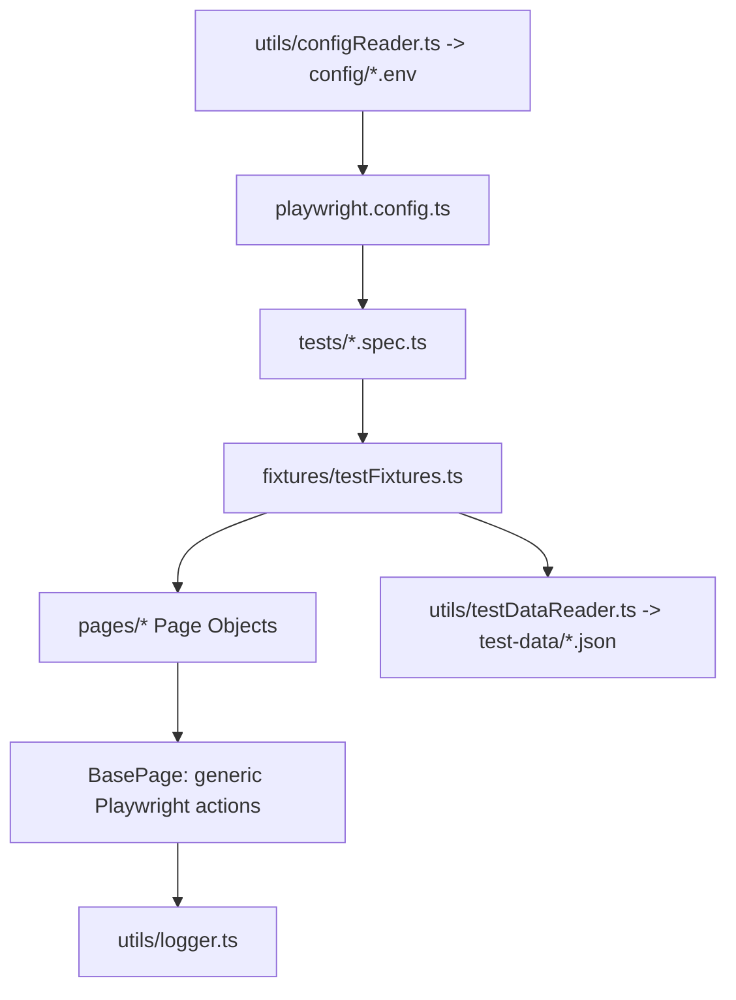

# OrangeHRM Playwright Automation Framework

## 1. Framework Overview

A TypeScript UI automation framework built on **Playwright Test** using the **Page Object Model (POM)**. It targets the [OrangeHRM demo](https://opensource-demo.orangehrmlive.com/web/index.php/auth/login) and demonstrates typed fixtures, data-driven tests, multi-environment configuration, retries, screenshots, videos, traces, Allure reporting, and centralized logging.



## 2. Technologies Used

| Tool | Purpose |
|---|---|
| TypeScript | Strongly typed test code |
| Playwright / Playwright Test | Browser automation, runner, fixtures, assertions, retries, artifacts |
| Node.js | Runtime |
| Chromium | Default browser |
| dotenv / cross-env | Environment selection (`dev`, `qa`, `staging`) |
| allure-playwright / Allure 3 | Rich reporting |
| JSON | Test data |
| @faker-js/faker | Unique generated records for PIM/Admin tests |

## 3. Project Structure

```text
├── pages/
│   ├── BasePage.ts            # Generic Playwright helpers (no app locators)
│   ├── LoginPage.ts           # Login locators/actions
│   ├── DashboardPage.ts       # Dashboard heading, navigation, logout
│   ├── AdminPage.ts           # Admin menu/heading
│   ├── AdminUsersPage.ts      # System-user management (extends AdminPage)
│   ├── ForgotPasswordPage.ts  # Password recovery
│   └── PimPage.ts             # Employee management
├── tests/
│   ├── login.spec.ts          # Valid/invalid/data-driven login + title
│   ├── dashboard.spec.ts      # Dashboard navigation
│   ├── admin.spec.ts          # Admin navigation + system-user creation
│   ├── forgot-password.spec.ts
│   └── pim.spec.ts
├── fixtures/testFixtures.ts   # Page-object, test-data and lifecycle-logging fixtures
├── utils/
│   ├── logger.ts              # Central DEBUG/INFO/WARN/ERROR logger
│   ├── configReader.ts        # Loads config/<ENV>.env, typed settings
│   ├── testDataReader.ts      # Typed, validated JSON reader
│   └── userTestData.ts        # Faker-generated user data
├── test-data/loginData.json
├── config/{dev,qa,staging}.env
├── reports/allure-results/    # Allure raw results (generated)
├── logs/test-execution.log    # Execution log (generated)
├── screenshots/               # Manual BasePage.takeScreenshot() output
├── traces/  videos/           # Reserved artifact folders
├── playwright.config.ts
├── package.json
├── tsconfig.json
└── .env.example
```

## 4. Prerequisites

- Node.js 20.19+ (LTS recommended) and npm
- Git
- Allure 3 is installed as an npm dependency, so you don't need Java.

## 5. Node.js Installation

Download the LTS installer from <https://nodejs.org> (or use `nvm`/`nvm-windows`), then verify:

```bash
node -v
npm -v
```

## 6. Project Setup

```bash
git clone <repository-url>
cd ORANGEHRM
cp .env.example .env   # optional local overrides; never commit .env
```

## 7. npm install

```bash
npm install
```

## 8. Playwright Browser Installation

```bash
npx playwright install chromium
# Linux CI agents may also need: npx playwright install --with-deps chromium
```

## 9. Environment Configuration

`utils/configReader.ts` reads `ENV` (default `qa`) and loads `config/<ENV>.env`. Values from the shell take precedence over the `.env` files. Supported keys:

```ini
BASE_URL=https://opensource-demo.orangehrmlive.com/web/index.php/
BROWSER=chromium
HEADLESS=true
TIMEOUT=30000
EXPECT_TIMEOUT=10000
ACTION_TIMEOUT=10000
NAVIGATION_TIMEOUT=20000
WORKERS=1
```

```bash
npm run test:dev
npm run test:qa
npm run test:staging
npx cross-env ENV=staging HEADLESS=false playwright test
```

Tests navigate with relative paths (`auth/login`), so the tests contain no environment URLs. Keep secrets in `.env` or your CI secret store, never in tracked files.

## 10. Running All Tests

```bash
npm test
```

## 11. Running Headed Tests

```bash
npm run test:headed
```

## 12. Running a Specific Test

```bash
npx playwright test tests/admin.spec.ts
npx playwright test -g "valid login"
npx playwright test tests/login.spec.ts:54
```

## 13. Running Smoke Tests

```bash
npm run test:smoke        # --grep @smoke
npm run test:regression   # --grep @regression
```

The tags `@smoke`, `@regression` and `@negative` go in test titles.

## 14. Running Login Tests

```bash
npm run test:login
```

## 15. Debugging Tests

```bash
npm run test:debug                       # Playwright Inspector
npx playwright test --ui                 # UI mode with time-travel
npx playwright codegen <BASE_URL>        # Locator discovery
```

To follow the actions taken, check `logs/test-execution.log`.

## 16. Retries

```ts
retries: process.env.CI ? 2 : 0
```

Retries run only on CI, where shared infrastructure and network latency cause occasional transient failures. Locally, retries are `0` so failures show up immediately. Keep retries low and treat every test that passes only on retry as **flaky**. Playwright marks these tests as flaky in its reports, and each one needs investigating. Retries must never hide a real defect or a bad locator or synchronization.

## 17. Screenshots

`screenshot: 'only-on-failure'` attaches a screenshot to every failed test under `test-results/<test>/`, and the screenshot also appears in the HTML and Allure reports. For a deliberate capture, use `BasePage.takeScreenshot(name)`, which saves to `screenshots/` and logs the file path.

## 18. Videos

`video: 'retain-on-failure'` records every test but keeps the video only for failed tests (`test-results/<test>/video.webm`). This avoids storing videos of passing tests.

## 19. Traces

`trace: 'retain-on-failure'` keeps a `trace.zip` for each failed test, with actions, DOM snapshots, console output and network activity:

```bash
npx playwright show-trace test-results/<failed-test-folder>/trace.zip
```

You can also drag the file into <https://trace.playwright.dev>.

## 20. Allure Reports

The `allure-playwright` reporter writes raw results to `reports/allure-results/` on each run.

```bash
npx playwright test
npx allure generate reports/allure-results --clean -o reports/allure-report   # or: npm run allure:generate
npx allure open reports/allure-report                                         # or: npm run allure:open
npm run test:allure                                                           # run + report in one step
```

Results accumulate between runs. To get a report for a single run only, delete `reports/allure-results/*` first. The built-in Playwright HTML report opens with `npm run test:report`.

## 21. Adding a New Page Object

1. Create `pages/LeavePage.ts` and have it extend `BasePage`.
2. Declare the locators as `private readonly` fields, built in the constructor with `getByRole`, `getByLabel` or `getByText`.
3. Expose business actions (for example `applyLeave()`) and locator getters for assertions.

```ts
export class LeavePage extends BasePage {
  private readonly leaveMenu: Locator;
  constructor(page: Page) {
    super(page);
    this.leaveMenu = page.getByRole('link', { name: 'Leave', exact: true });
  }
  async open(): Promise<void> {
    await this.click(this.leaveMenu, 'Leave menu');
  }
}
```

## 22. Adding a New Test

```ts
import { test, expect } from '../fixtures/testFixtures';

test('LEAVE-001 open leave list @regression', async ({ loginPage, leavePage, loginData }) => {
  await loginPage.navigateToLoginPage();
  await loginPage.login(loginData.validLogin.username, loginData.validLogin.password);
  await leavePage.open();
  await expect(leavePage.getHeading()).toBeVisible();
});
```

Use web-first assertions such as `toBeVisible`, `toHaveURL` and `toHaveTitle`. Don't put locators or `waitForTimeout()` in test files.

## 23. Adding JSON Test Data

1. Add the case to `test-data/loginData.json` (for example `"lockedUser": { "username": "...", "password": "..." }`).
2. Add the key to the `LoginTestData` interface and the validated `cases` list in `utils/testDataReader.ts`.
3. Use it through the `loginData` fixture, or loop over the cases to run data-driven tests:

```ts
for (const scenario of [{ name: 'invalid username', dataKey: 'invalidUsername' }] as const) {
  test(`reject ${scenario.name}`, async ({ loginPage, loginData }) => { /* ... */ });
}
```

## 24. Using Fixtures

`fixtures/testFixtures.ts` extends Playwright's `test` with:

- `loginPage`, `dashboardPage`, `adminPage`, `adminUsersPage`, `pimPage` and `forgotPasswordPage`, each built from the same `page` object
- `loginData`, the typed and validated JSON login data
- `testLifecycle`, an auto fixture that logs each test's start and finish, its status and any errors

To register a new page object, add it to the `Fixtures` type and add one `async ({ page }, use) => use(new XPage(page))` entry.

## 25. Coding Standards

- POM: application locators live only in their page object. `BasePage` stays generic.
- No locators in tests and no hard-coded waits. Rely on auto-waiting and web-first assertions.
- Locator priority: `getByRole` → `getByLabel`/`getByPlaceholder` → `getByText`. Use CSS only where the demo has no accessible name.
- Strict TypeScript. Run `npx tsc --noEmit` before committing.
- Config, logging and test data are each centralized. Never log passwords.
- Tests are independent, tagged, and named with test-case IDs.
- DRY and SOLID where they help. Add abstractions only when they remove real duplication.

## Scope and Limitations

The framework runs against a shared public demo. Demo credentials are public, and the generated accounts are saved to the git-ignored `test-data/createdUser.json`. Forgot-password tests check only the UI confirmation, not email delivery. The default is one worker because the tests change shared data.
